# 🌟 FelloWs - Next-Generation Maternity Platform
### *"Women Who Care" - Revolutionizing Cultural-Sensitive Maternity Care*

<div align="center">


[](https://opensource.org/licenses/MIT)
[](https://nodejs.org/)
[](https://www.typescriptlang.org/)
[](https://vitejs.dev/)
[](https://mermaid.js.org/)

</div>

## 🚀 Overview

FelloWs represents a **paradigmatic shift** in maternal support applications by seamlessly integrating evidence-based medicine with profound cultural sensitivity. This revolutionary platform addresses the critical gap in cross-cultural maternal care through a personalized digital companion that provides contextually relevant guidance to expectant mothers while deeply respecting their cultural backgrounds.

### 🌍 Revolutionary Concept: Cultural-Medical Bridge

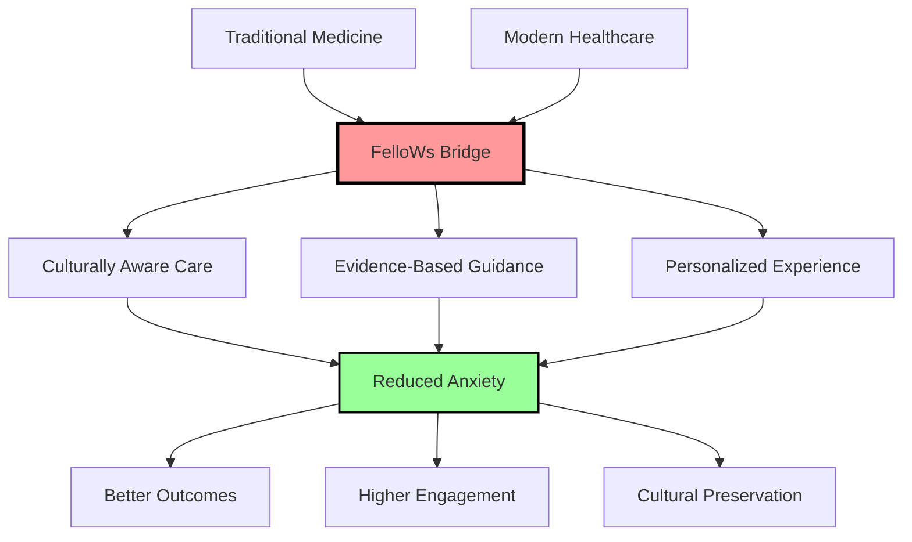

## 🎯 Core Innovation Framework

### Revolutionary Aspects

FelloWs introduces several groundbreaking concepts that transform traditional maternity care:

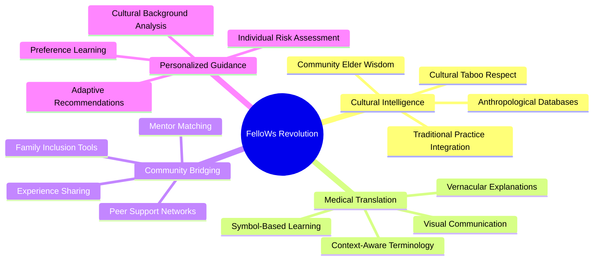

### 🔄 Ported Ideas and Innovations

FelloWs strategically adapts and revolutionizes concepts from various domains:

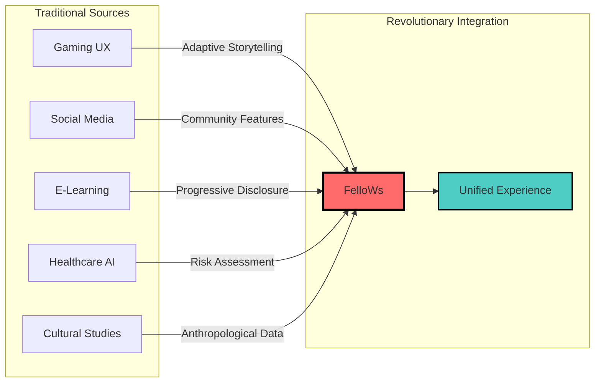

## 🏛️ System Architecture

### High-Level Architecture Overview

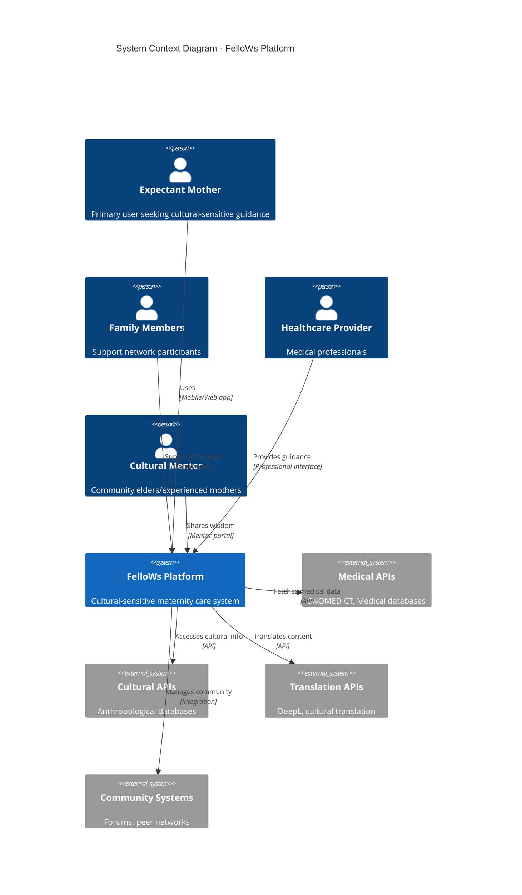

### Technical Stack Architecture

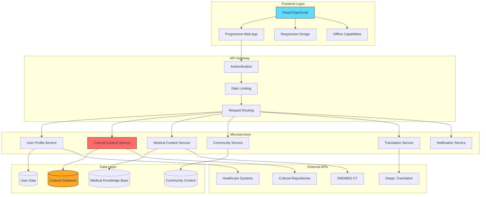

## 👥 User Personas and Journeys

### Primary Persona: Amina's Journey

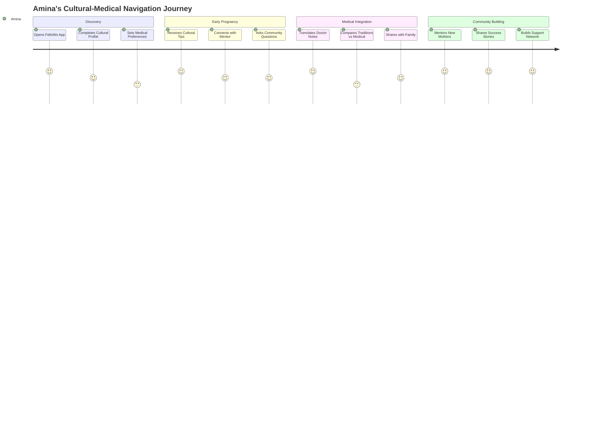

### User Ecosystem Map

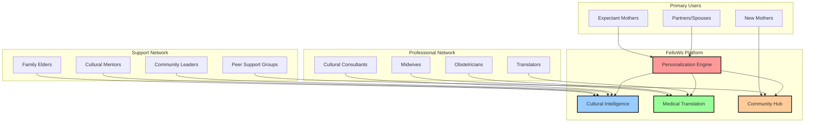

## 🌐 Cultural Integration Framework

### Cultural Sensitivity Model

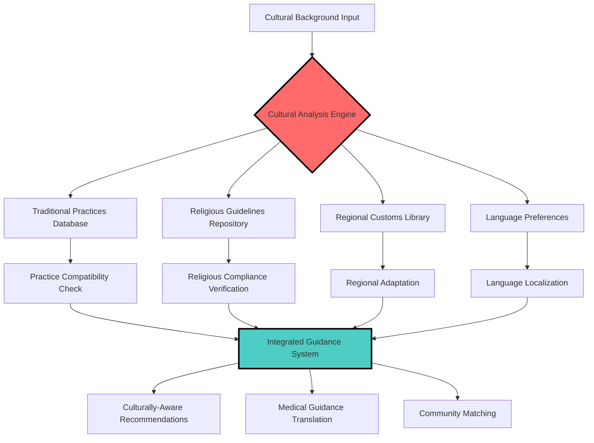

### Cross-Cultural Communication Matrix

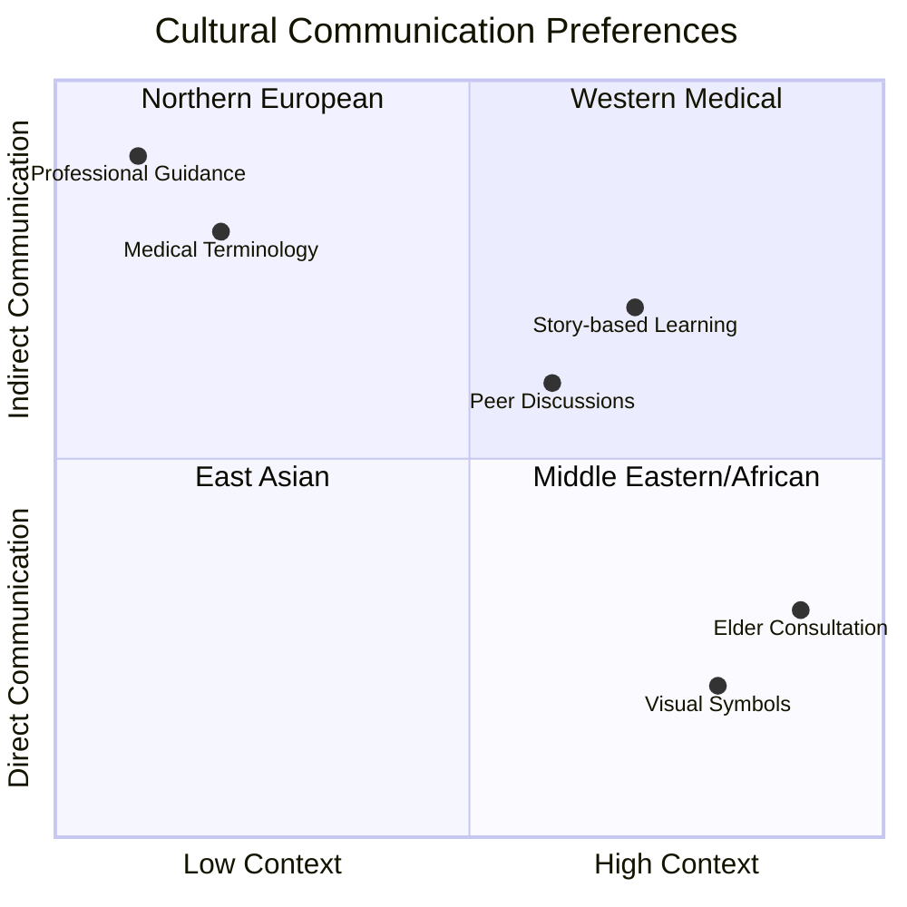

## 🚀 Features and Capabilities

### Core Feature Architecture

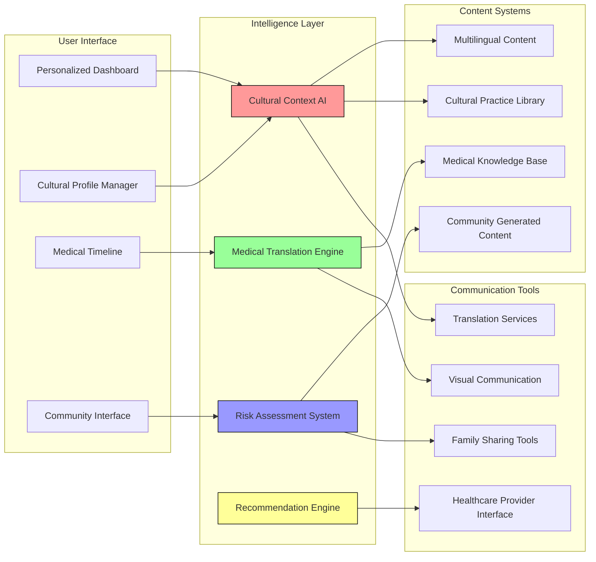

### Feature Evolution Timeline

```mermaid
timeline
    title FelloWs Feature Development Roadmap
    section Phase 1 : Foundation
        Cultural Profiling     : Basic cultural background input
                             : Traditional practice identification
        Medical Translation    : SNOMED CT integration
                             : Basic terminology translation
        Community MVP         : Simple peer matching
                             : Basic forum functionality
    
    section Phase 2 : Intelligence
        AI-Powered Matching   : Advanced cultural compatibility
                             : Intelligent mentor assignment
        Smart Recommendations : Context-aware suggestions
                             : Personalized care plans
        Enhanced Translation  : Visual symbol integration
                             : Cultural context preservation
    
    section Phase 3 : Ecosystem
        Healthcare Integration : Provider tools
                             : EHR connectivity
        Family Tools          : Multi-generational support
                             : Cultural knowledge sharing
        Advanced Community    : Mentorship programs
                             : Cultural celebration features
```

## 🔒 Privacy and Security Framework

### Data Protection Architecture

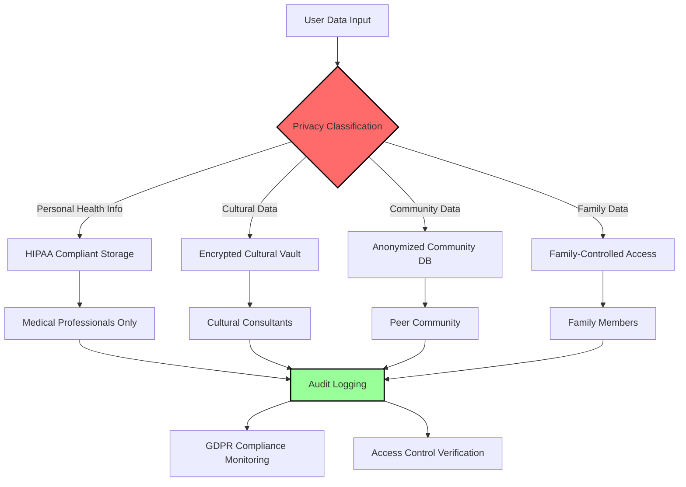

### Security Layers

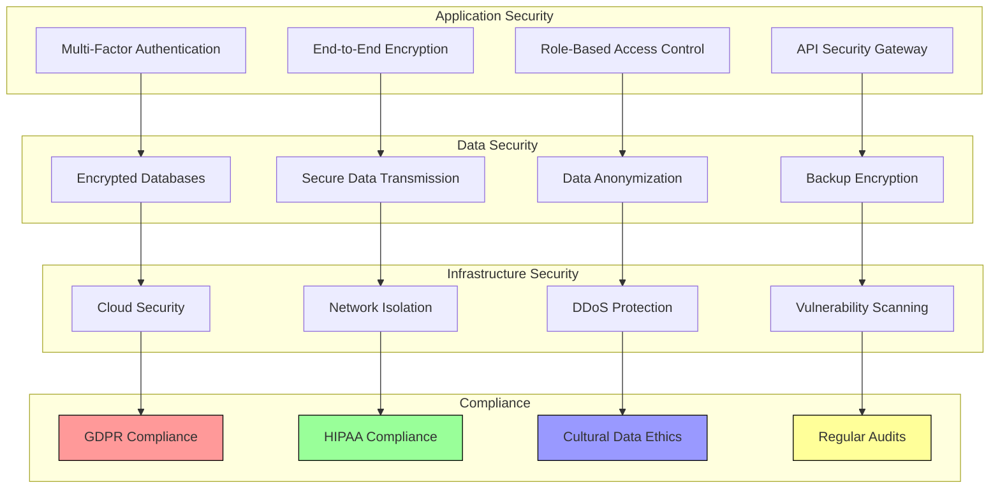

## 📊 Impact and Analytics Framework

### Success Metrics Dashboard

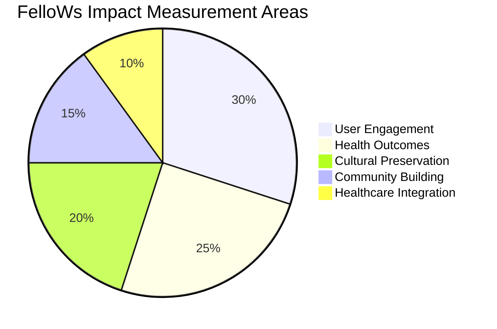

### Data Flow for Analytics

```mermaid
sankey-beta
    title Analytics Data Flow

    User Interactions,Cultural Insights,500
    User Interactions,Health Tracking,300
    User Interactions,Community Engagement,200
    
    Cultural Insights,Cultural Preservation Index,300
    Cultural Insights,Mentor Effectiveness,200
    
    Health Tracking,Outcome Improvements,250
    Health Tracking,Risk Reduction,50
    
    Community Engagement,Network Growth,150
    Community Engagement,Support Quality,50
    
    Cultural Preservation Index,Platform Success,300
    Mentor Effectiveness,Platform Success,200
    Outcome Improvements,Platform Success,250
    Risk Reduction,Platform Success,50
    Network Growth,Platform Success,150
    Support Quality,Platform Success,50
```

## 🗺️ Implementation Roadmap

### Development Phases

```mermaid
gantt
    title FelloWs Development and Rollout Timeline
    dateFormat  YYYY-QQ
    axisFormat  %Y-Q%q
    
    section Phase 1: Foundation
    Cultural Profiling System    :p1a, 2025-Q1, 2Q
    Medical Translation MVP      :p1b, after p1a, 1Q
    Basic Community Platform     :p1c, after p1a, 2Q
    
    section Phase 2: Intelligence
    AI Recommendation Engine     :p2a, after p1b, 2Q
    Advanced Cultural Matching   :p2b, after p2a, 1Q
    Smart Content Personalization :p2c, after p2b, 1Q
    
    section Phase 3: Integration
    Healthcare Provider Tools    :p3a, after p2a, 2Q
    Family Inclusion Features    :p3b, after p2c, 1Q
    Advanced Analytics          :p3c, after p3a, 1Q
    
    section Phase 4: Scale
    Multi-Regional Deployment   :p4a, after p3b, 3Q
    Enterprise Partnerships     :p4b, after p3c, 2Q
    Platform Ecosystem         :p4c, after p4a, 2Q
```

### Geographic Rollout Strategy

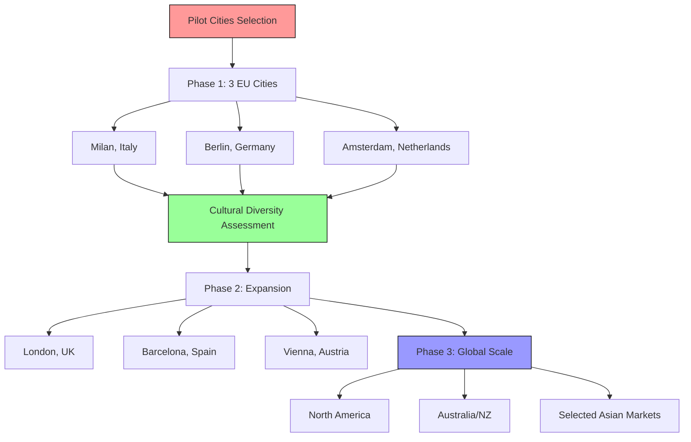

## 🤖 Technology Deep Dive

### AI and Machine Learning Architecture

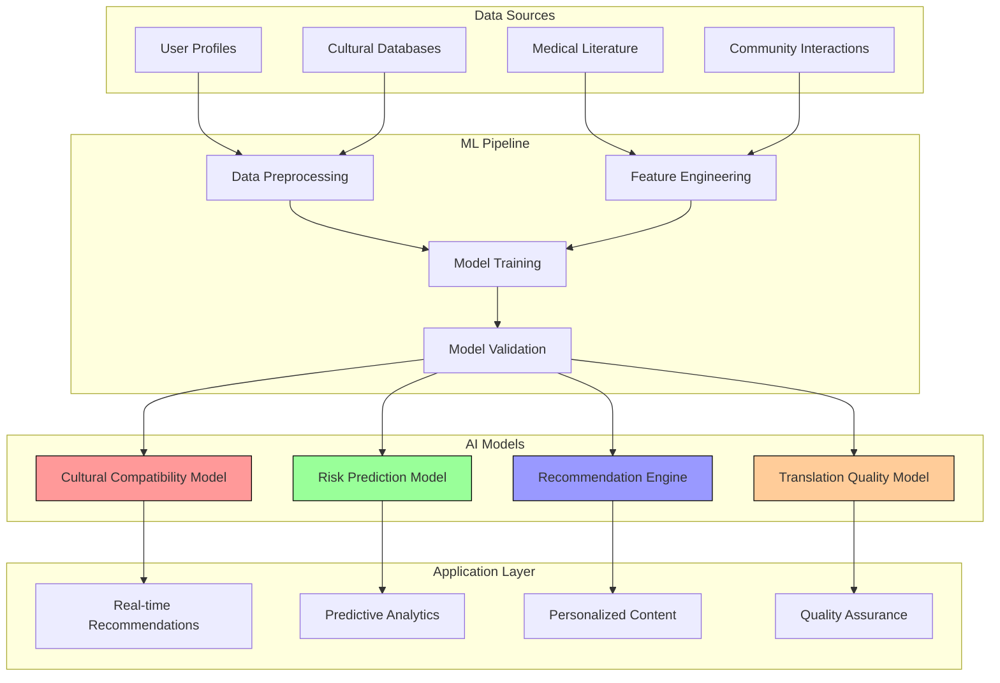

### Data Architecture

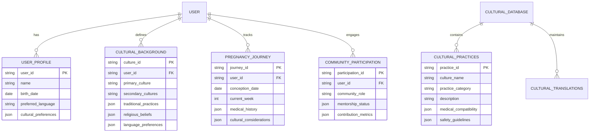

## 🌍 Cultural Innovation Framework

### Cultural Intelligence Engine

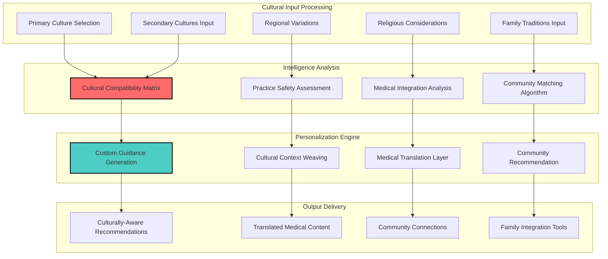

## 📈 Business Model and Sustainability

### Revenue Streams

```mermaid
pie title FelloWs Revenue Model
    "B2B Healthcare Partnerships" : 35
    "Premium Family Features" : 25
    "Cultural Consultation Services" : 20
    "Enterprise Licensing" : 15
    "Data Insights (Anonymized)" : 5
```

### Market Positioning

```mermaid
quadrantChart
    title Market Positioning Analysis
    x-axis Traditional Approach --> Innovation Focus
    y-axis Low Cultural Sensitivity --> High Cultural Sensitivity
    
    quadrant-1 Innovative but Generic
    quadrant-2 Innovative and Cultural
    quadrant-3 Traditional and Generic  
    quadrant-4 Traditional but Cultural
    
    FelloWs: [0.9, 0.9]
    BabyCenter: [0.3, 0.2]
    Ovia Pregnancy: [0.6, 0.3]
    What to Expect: [0.2, 0.1]
    Nurture: [0.4, 0.6]
    Pregnancy+: [0.5, 0.2]
```

## 🔬 Research and Development

### Ongoing Research Areas

```mermaid
mindmap
  root((R&D Focus Areas))
    Cultural AI
      Anthropological ML Models
      Traditional Practice Safety
      Cultural Evolution Tracking
      Intergenerational Knowledge Transfer
    Medical Integration
      Clinical Outcome Studies
      Cultural Practice Validation
      Safety Protocol Development
      Healthcare Provider Training
    Community Dynamics
      Peer Support Effectiveness
      Mentorship Program Optimization
      Cultural Community Building
      Family Integration Strategies
    Technology Innovation
      Real-time Translation Accuracy
      Cultural Context Preservation
      Privacy-Preserving Analytics
      Accessibility Improvements
```

### Clinical Validation Framework

```mermaid
flowchart LR
    A[Research Hypothesis] --> B[Study Design]
    B --> C[IRB Approval]
    C --> D[Participant Recruitment]
    D --> E[Data Collection]
    E --> F[Statistical Analysis]
    F --> G[Peer Review]
    G --> H[Publication]
    H --> I[Feature Integration]
    I --> J[Continuous Monitoring]
    J --> A
    
    style A fill:#ff9999,stroke:#000
    style I fill:#99ff99,stroke:#000
    style J fill:#9999ff,stroke:#000
```

## 🌟 Competitive Advantages

### Unique Value Proposition Matrix

```mermaid
graph TB
    subgraph "Traditional Maternity Apps"
        A[Generic Medical Content]
        B[One-Size-Fits-All Approach]
        C[Limited Cultural Awareness]
        D[Basic Community Features]
    end
    
    subgraph "FelloWs Revolutionary Approach"
        E[Culturally-Contextualized Medicine]
        F[Deeply Personalized Experience]  
        G[Anthropological Intelligence]
        H[Intergenerational Wisdom Integration]
    end
    
    subgraph "Competitive Moats"
        I[Cultural Database Depth]
        J[AI-Powered Cultural Translation]
        K[Community Elder Integration]
        L[Healthcare Provider Partnerships]
    end
    
    A -.-> E
    B -.-> F
    C -.-> G
    D -.-> H
    
    E --> I
    F --> J
    G --> K
    H --> L
    
    style E fill:#ff6b6b,stroke:#000,stroke-width:2px
    style F fill:#4ecdc4,stroke:#000,stroke-width:2px
    style G fill:#45b7d1,stroke:#000,stroke-width:2px
    style H fill:#96ceb4,stroke:#000,stroke-width:2px
```

## 🚀 Quick Start Guide

### Prerequisites
- **Node.js 18+**
- **TypeScript 5.8+**
- **Modern Web Browser**
- **Git**

### Installation and Setup

```bash
# Clone the repository
git clone https://github.com/andiekobbietks/FelloWs-OS-Next-Gen-Maternity-Platform.git

# Navigate to project directory
cd FelloWs-OS-Next-Gen-Maternity-Platform

# Install dependencies
npm install

# Create environment file
cp .env.example .env.local

# Set your Gemini API key in .env.local
echo "GEMINI_API_KEY=your_api_key_here" >> .env.local

# Start development server
npm run dev

# Build for production
npm run build

# Preview production build
npm run preview
```

### Exploring the FelloWs OS Simulation

The application presents as a retro Windows 95-style OS interface that allows you to explore the comprehensive Product Requirements Document (PRD) for FelloWs:

1. **Start the Simulation**: Click on "Start FelloWS OS" icon
2. **Navigate Sections**: Use the Start menu to explore different aspects
3. **Interactive Windows**: Drag, resize, and manage multiple windows
4. **Mermaid Visualizations**: Explore charts and diagrams throughout
5. **Cultural Explanations**: Hover over Italian explanations for context

### Development Structure

```
FelloWs-OS-Next-Gen-Maternity-Platform/
├── index.html              # Main HTML entry point
├── index.tsx               # TypeScript application logic
├── index.css               # Retro OS styling
├── package.json            # Dependencies and scripts
├── tsconfig.json           # TypeScript configuration
├── vite.config.ts          # Build configuration
└── README.md               # This comprehensive guide
```

## 📞 Contact and Contributing

### Getting Involved

FelloWs is more than a platform—it's a movement toward culturally-sensitive healthcare. We welcome contributions from:

- **Healthcare Professionals**: Medical accuracy and cultural competence
- **Cultural Consultants**: Traditional practice validation and safety
- **Technology Experts**: AI/ML, privacy, and scalability improvements
- **Community Leaders**: User experience and cultural representation
- **Researchers**: Clinical validation and outcome studies

### Community Guidelines

```mermaid
graph LR
    A[Respect] --> B[Cultural Sensitivity]
    A --> C[Medical Accuracy] 
    A --> D[Privacy Protection]
    
    B --> E[Inclusive Participation]
    C --> E
    D --> E
    
    E --> F[Better Maternal Outcomes]
    E --> G[Cultural Preservation]
    E --> H[Healthcare Innovation]
    
    style A fill:#ff6b6b,stroke:#000,stroke-width:2px
    style E fill:#4ecdc4,stroke:#000,stroke-width:2px
    style F fill:#96ceb4,stroke:#000,stroke-width:2px
    style G fill:#ffa726,stroke:#000,stroke-width:2px
    style H fill:#ab47bc,stroke:#000,stroke-width:2px
```

---

<div align="center">

### 🌟 **"FelloWs - Where Tradition Meets Innovation in Maternal Care"** 🌟

*Empowering women across cultural boundaries with personalized, respectful, and evidence-based maternal guidance*

[](https://github.com/andiekobbietks/FelloWs-OS-Next-Gen-Maternity-Platform/stargazers)
[](https://github.com/andiekobbietks/FelloWs-OS-Next-Gen-Maternity-Platform/network/members)

</div>
